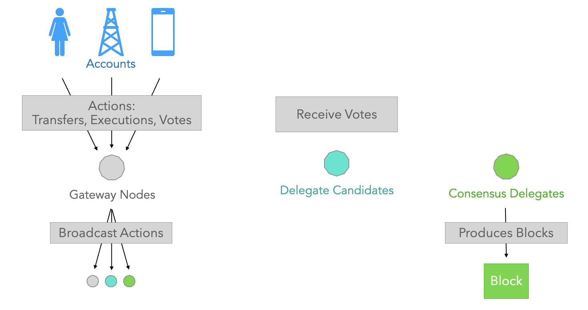

# Blockchain Nodes

## Overview

Similar to other blockchains, IoTeX is a peer-to-peer network of **nodes** that maintain a global consensus over the status of a single ledger, replicated among the nodes of the blockchain in a distributed fashion. IoTeX is also a _digital democracy_, where anyone can configure a node and propose himself to become a **Delegate** node. Token-holders that **stake** their IOTX tokens have the right to **vote** for Delegates to maintain/grow the network on their behalf. Every 1 hour (aka "_Epoch"_), the ranking of all delegate candidates is evaluated by the blockchain, and the top 36 voted Delegates get elected as **Consensus Delegates** for that epoch.

## Node types


These features are a work in progress - not yet released.


In IoTeX there are four types of node:

* **Archive-Gateway**: This is a _heavy-duty_ full-node with API support: it stores a full copy of the blockchain, the status of all accounts, and the accounts index database so that it can serve as a **Consensus Delegate**, securely verifying any new incoming transaction against the actual status of the ledger. Additionally, it can serve as a **Gateway** for communication with the blockchain, supporting API queries of account and contract states, both **on current block height and any past block height**. _\[Archive nodes will be available from release 1.2 of the blockchain]_
* **FullNode-Gateway**: This is a _normal_ full-node with API support: it stores a full copy of the blockchain, the status of all accounts, and the accounts index database so that it can serve as a **Consensus Delegate**, as well as a **Gateway** for communication with the blockchain, supporting API queries of account and contract states **on current block height only**.
* **FullNode**: This is a _normal_ full-node: it stores a full copy of the blockchain and the status of all accounts, so that it can serve as **Consensus Delegate**, but **not** as a Gateway for communication with the blockchain, as it does not support API queries.
* **LightNode**: This is a _light_ node: it only stores the headers of past blocks up to a certain block height, so that it cannot serve as Consensus Delegate, and it cannot be a gateway. It can only act as a local, lightweight **validation node**. _\[Light nodes will be available from release 1.3 of the blockchain]_


Interested in becoming a IoTeX Delegate? Check out [the official forum thread](https://community.iotex.io/t/official-iotex-delegates-thread/1263) for instructions. Also, you can see the full list of Delegates on the IoTeX [Voting Portal ](https://member.iotex.io/)and [Block Explorer](https://iotexscan.io/).

