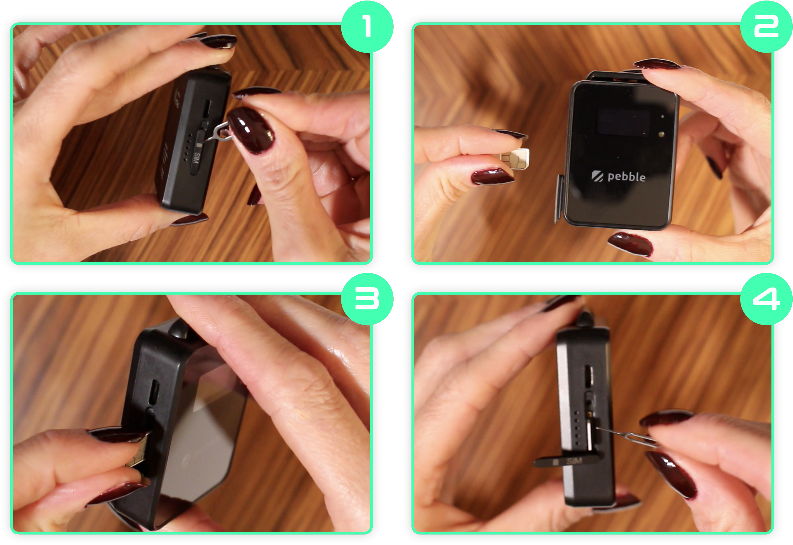
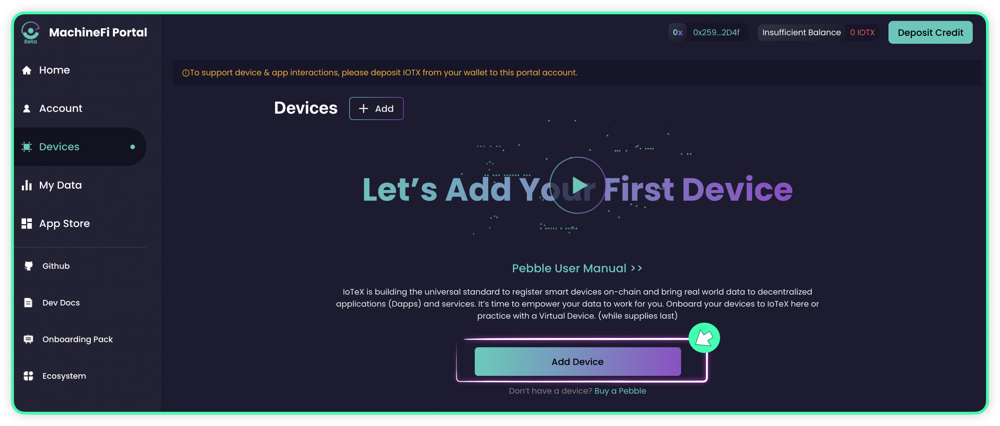
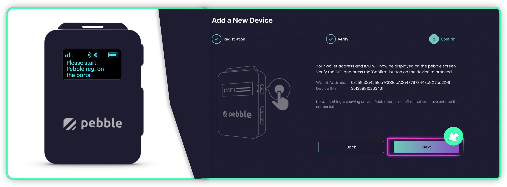
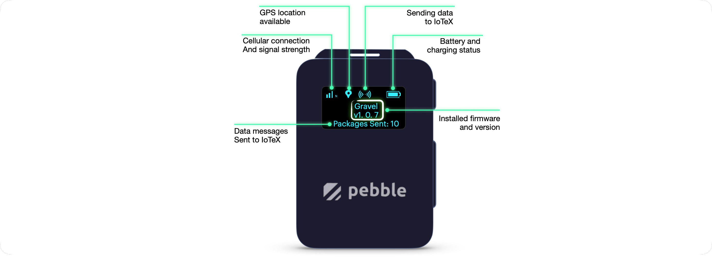

# Quick Start

Congratulations on receiving your Pebble Tracker!

This quick start guide will help you with power on your device and connect it to the IoTeX [MachineFi portal](https://portal.machinefi.com).

### Unboxing

Before turning on Pebble Tracker, let's take a look at what's in the box:

### Finding a SIM Card

Pebble Tracker connectivity is based on the new [_Narrowband-IoT_](https://en.wikipedia.org/wiki/Narrowband\_IoT) cellular technology, which provides radio bands that are optimized for Internet of Things applications like smart metering, industrial controls, residential security, etc.


**The SIM card is not included with Pebble Tracker.**


IoTeX has partnered with [1NCE](https://1nce.com), an IoT SIM cards provider that covers 100 countries and regions globally, providing a convenient data plan: [if your country is covered](https://1nce.com/wp-content/2022-1NCE-Coverage.pdf), you can buy a Pebble-ready SIM card on the dedicated IoTeX "**Autobahn.earth**" portal:



If your country is not currently covered by the 1NCE network, below are some useful information for you to find a working SIM card for your Pebble Tracker:


**Is your country covered by the Narrowband-IoT network?**

Please check if either NB-IoT or LTE-M is available in your Country [on the gsma website](https://www.gsma.com/iot/deployment-map/).  Once you know which technology is supported, please find a local or international provider where you can buy a SIM card that supports the correct technology for your country.



**Make sure the IoT SIM card you buy supports either NB-IoT or LTE-M**

Please notice that Pebble tracker does not support GSM, 3G, or 4G bands:\
make sure your SIM card provider supports either **NB-IoT** or **LTE-M** or both in your country.


If you have issues finding a working SIM card, please join this forum discussion where other community members share their experiences with different SIM card providers in their country:



### Installing the SIM card

Once you have a SIM card, use a paperclip or the provided SIM card tool to open the SIM slot and push the card inside:

### Powering On

Press and keep pressing the **power**/**confirm** button on the right side of Pebble until you see the IoTeX logo on the screen. Wait until the cellular connection is established and Pebble Tracker starts communicating with the TruStream network.

If this Pebble Tracker has not been registered yet, it will prompt you for starting the device registration process that will add it to your MachineFi portal account:

.jpg>)

Press the Power/Confirm button once, to start the registration process on the Pebble side:

.jpg>)

### Creating a MachineFi Account

Before we can register a Pebble on the IoTeX MachineFi portal, we need a blockchain account: we will associate all our devices with this account, which becomes the "_owner account_" for those devices:


**Prerequisites**:

* You have [Metamask](https://metamask.io/download.html) installed in your browser.
* You [added the IoTeX Network](https://iotexdefi.com) to Metamask&#x20;
* You own some native IOTX in your Metamask account&#x20;


Open the MachineFi device portal at [portal.machinefi.com](https://portal.machinefi.com), and **connect** a Metamask account that you want to use as your _Devices_ _Owner Account,_ the portal will automatically start the account registration process:



1. Assign a name to your MachineFi account
2. Confirm the account creation dialog
3. Sign the transaction in Metamask

### Depositing Credit

Once a MachineFi account is created, you should **deposit some IOTX credit**. This step is not strictly required at this moment: if you want, you can skip it and go ahead with registering your Pebble. You can deposit credit at any moment.&#x20;


While you do not need any credit to monitor your Pebble data history on the MachineFi portal, please keep in mind that you need to deposit IOTX into your MachineFi account to allow your device to send data to IoTeX Dapps.


To deposit some credit:

1. Switch to the [**Account**](https://portal.machinefi.com/account) page&#x20;
2. Click the **Deposit Credit** button&#x20;
3. Input the amount of IOTX you want to deposit
4. Confirm the deposit dialog
5. Finally, confirm the transaction in Metamask&#x20;

.jpg>)

On the same **Account** page, you can also withdraw your MachineFi credit at any time, as well as check the list of all your account transactions.

### Registering your Pebble

You can now switch to the [**Devices**](https://portal.machinefi.com/device) tab of the portal, which lists all the devices you associated with your MachineFi account. For a newly created account, with no devices added yet, the page will look like the one below, just click the **Add Device** button:

&#x20;select "**Pebble**" to register and add a new Pebble Tracker to your MachineFi account:

.jpg>)

Follow the registration screens until you reach the "Confirm" step, where the owner address and device IMEI number are shown:


Make sure your Pebble is powered on and [prompting for device registration](quick-start.md#power-on).


Go ahead and press the **Next** button, confirm the transaction in Metamask, and wait for your Metamask account address to be displayed on the Pebble tracker screen:

Finally, we complete the registration on the device side by pressing the Power/Confirm button once more, and waiting for Pebble to complete the registration:

The "[**Devices**](https://portal.machinefi.com/device)" page will show the Pebble Tracker you just registered, marked as a "**Confirmed**" device:

### Congratulations!

Your Pebble is ready to send IoT data to IoTeX Dapps and fuel the _MachineFi_ blockchain revolution!

Here is how your Pebble screen should look like:

By default, the factory configuration will collect all Pebble sensors data, and send one data message every 5 minutes to the IoTeX TruStream network.


**Please notice** that the factory firmware introduces a \~500m random offset to the GPS coordinates. Depending on the installed Dapp, sensors' configurations may differ.&#x20;


You can monitor your real-time device sensors directly on the MachineFi portal by going to the [**My Data**](https://portal.machinefi.com/myData) page:

.jpg>)
