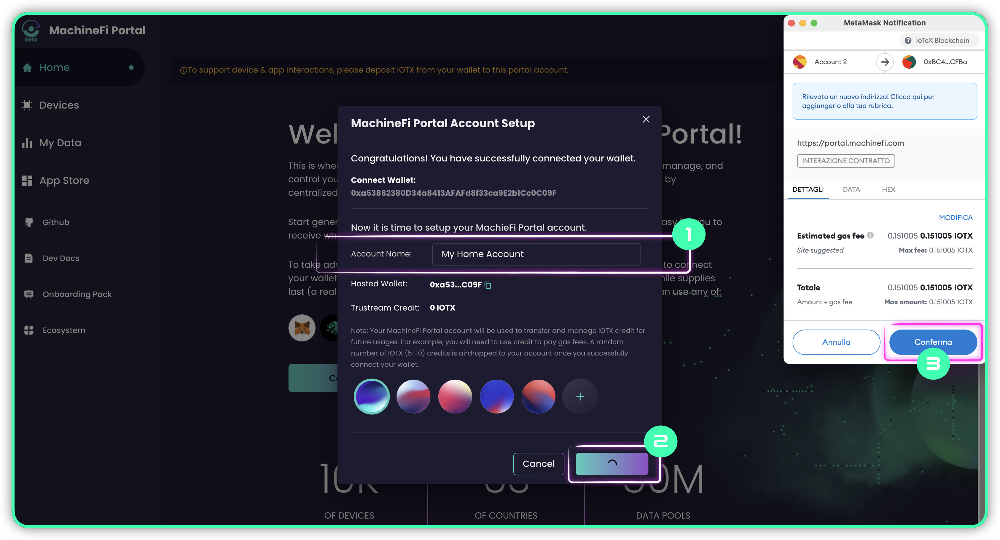
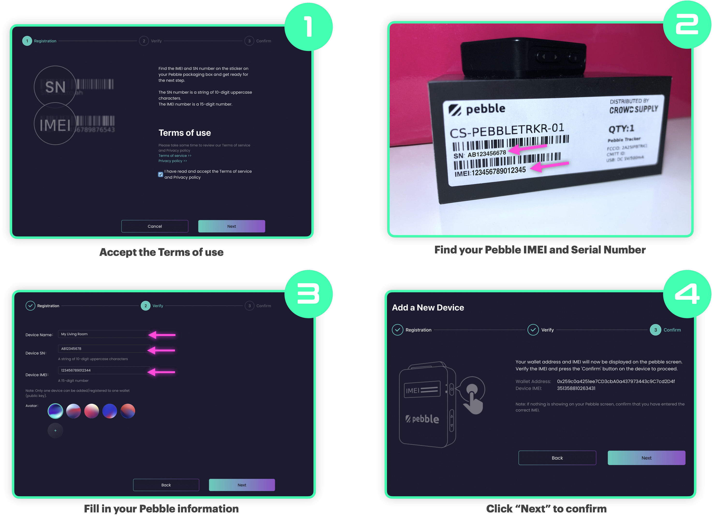
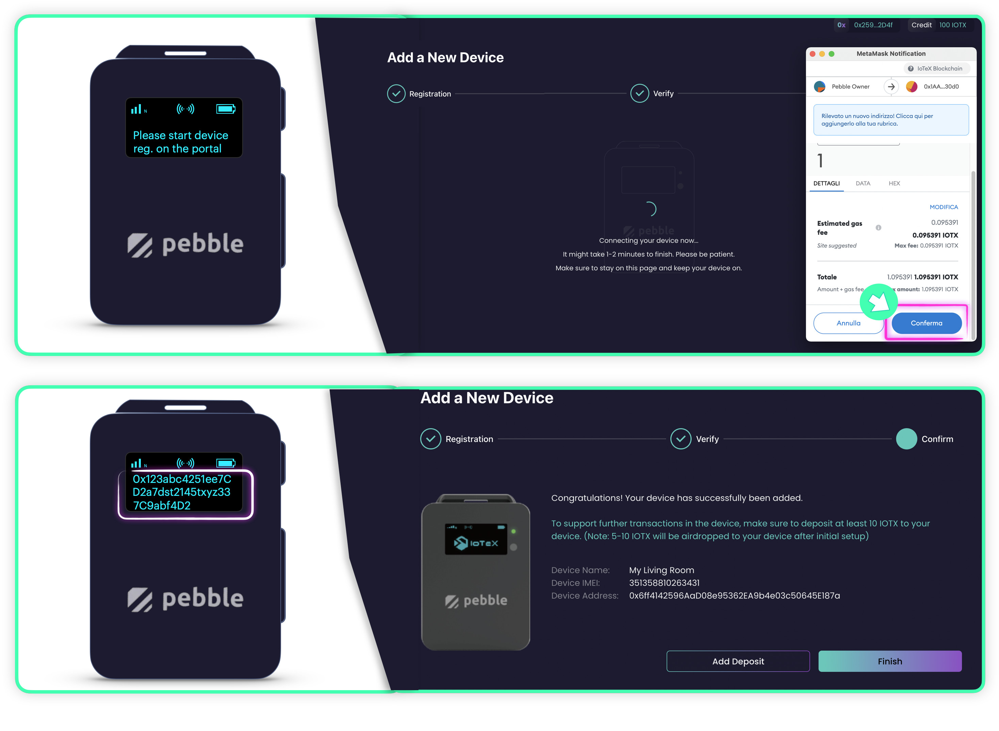

# Quick Start

Congratulations on receiving your Pebble Tracker!

This quick start guide will help you with power on your device and connect it to the IoTeX [MachineFi portal](https://portal.machinefi.com).

### Unboxing

Before turning on Pebble Tracker, let's take a look at what's in the box:

### Finding a SIM Card

Pebble Tracker connectivity is based on the new _low-bandwidth_ cellular protocols "NB-IoT" and "LTE-M": **you need a valid SIM card to allow Pebble to connect to the internet**. NB-IoT and LTE-M bands are optimized for Internet of Things applications like smart metering, industrial controls, residential security, etc... They consume less power, extend the device battery life, and reduce data plan costs, while still improving the range.


**The SIM card is not included with Pebble Tracker.**

You can verify NB-IoT / LTE-M networks coverage for your Country on the [GSMA website](https://www.gsma.com/iot/deployment-map/). Then you should find a provider where you can buy a SIM card that supports NB-T or LTE-M in your Country.&#x20;


If you have issues finding a working SIM card, you can buy one from the IoTeX SIM card portal (**coming soon**). You can find the list of supported Countries below:




Please notice that Pebble tracker does not support the GSM, 3G, or 4G bands:\
make sure your SIM card provider supports either **NB-IoT** or **LTE-M** or both in your country.


### Installing the SIM card

Once you have a SIM card, use a paperclip or the provided SIM card tool to open the SIM slot and push the card inside:

### Powering On

Press and keep pressing the power/confirm button on the right side of Pebble until you see the IoTeX logo on the screen. Wait until the cellular connection is established and Pebble Tracker starts communicating with the TruStream network:

.jpg>)

If this is the first time you power on your Pebble Tracker, it will prompt you for adding the device to your account on the [MachineFi portal](https://portal.machinefi.com).

### Creating a MachineFi Account

Before we can register Pebble on the IoTeX network, we need a MachineFi portal account that will _own_ our devices.&#x20;


✅ **Prerequisites**:

* Make sure you have [Metamask](https://metamask.io/download.html) installed in your browser.
* That you [added the IoTeX Network](https://iotexdefi.com) to Metamask&#x20;
* And that you own some native IOTX in your Metamask account&#x20;


Open the MachineFi device portal at [portal.machinefi.com](https://portal.machinefi.com), and **connect** a Metamask account that you want to use as the _Owner Account_ for this Pebble: you can add more devices to the same account in the future.&#x20;



Assign a name to your MachineFi account, confirm the account creation dialog and sign the transaction in Metamask.

### Depositing Credit

Once the MachineFi account is created, we need to **deposit some IOTX credit to our MachineFi account**. This step is not strictly required in this stage: if you want, you can skip it and go ahead with adding your Pebble to the MachineFi account we just created, and also monitor your device data from the MachineFi portal itself.&#x20;


Please keep in mind that you need some credit deposited into your MachineFi account to allow IoTeX Dapps to use your device data.


To deposit some credit:

1. Switch to the "**Account**" page&#x20;
2. Click the "**Deposit Credit**" button&#x20;
3. Input the amount of IOTX you want to deposit
4. Confirm the deposit dialog
5. And finally, confirm the transaction in Metamask&#x20;

.jpg>)

The "Account" page will also allow you to withdraw your MachineFi credit at any time, as well as show the list of all your Account transactions.

### Registering your Pebble

We can now switch to the "**Devices**" tab of the portal, which lists all the devices you associated with your MachineFi account. For a newly created account with no devices added yet, the page will look like this:

In the device dialog, click the "**Add Device**" button, then select "**Pebble**" to register and add a new Pebble Tracker to your MachineFi account:

.jpg>)

Follow the registration screens up to your wallet address and device IMEI number confirmation:

Next, verify that you see your Metamask wallet address on the Pebble display and confirm the transaction in Metamask to confirm the association of Pebble Tracker with your MachineFi account:


Make sure your Pebble is powered on and [prompting for device registration](quick-start.md#power-on).


Finally, we complete the registration on the device side by pressing the power/confirm button and waiting for Pebble to complete the registration:

The "**Devices**" page will show the Pebble Tracker you just registered, marked as a "**Confirmed**" device:

### Congratulations!

Your Pebble is ready to send IoT data to IoTeX Dapps and fuel the _MachineFi_ blockchain revolution!

Here is how your Pebble screen should look like:

The factory Firmware will collect all Pebble sensors data, and send one data message every 5 minutes to the IoTeX TruStream network.


**Please notice** that the factory firmware introduces a \~500m random offset to the GPS coordinates. Depending on the installed Dapp, sensors configuration may different.&#x20;

